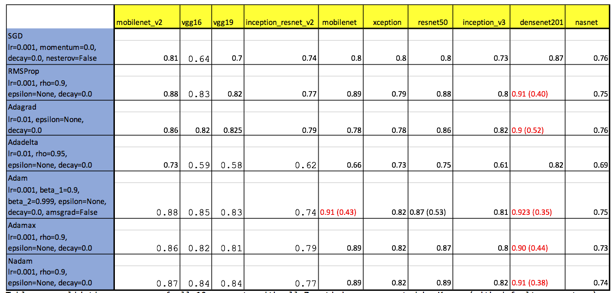
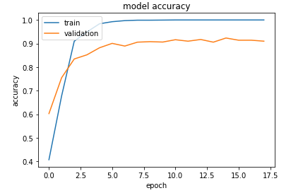
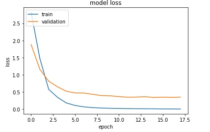
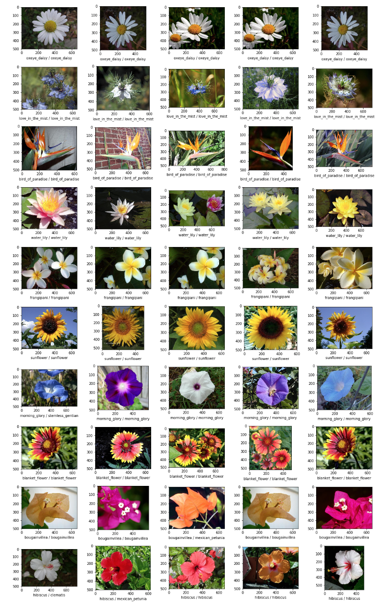

# Capstone Project - Udacity's Machine Learning Engineer Nanodegree


## Evaluation of Imagenet CNN Architectures for transfer learning classification of the Oxford102 Flower Dataset


### Hyperparameter optimization was performed for the imagenet architectures available in the Keras' applications models,  including all optimzers available in Keras


### Project Overview

Flower classification, as well as of other living-organisms, is an important task used both for scientific purposes (taxonomy in research or applied sciences, such as agronomy) and leisure. It has traditionally been cumbersome, requiring specific and specialized knowledge, as well as careful and time consuming analysis of anatomical characteristics. Not long ago this knowledge was kept in books, either to be brought to the field, of to be used in the lab, this requiring field trips to collect specimens. More recently, a much lighter version of this knowledge could be more conveniently transported to the field in a computer, or even on a smartphone. However, the process still remained the same as centuries ago, in which a person had to compare physical characteristics of the subject with the body of knowledge. This process can be greatly improved by automation, delegating the classification task to a computer.  Image classification is a common and important application of Machine Learning (ML). It is used on a wide range of applications, from individuals identification for security proposes, to identifying road signs in the live video feed of self-driving cars. This project develops a ML model to classify flowers from their images, while evaluating performance  and cost (time and money) tradeoffs. 


### Dataset: 

[Oxfoard102](http://www.robots.ox.ac.uk/~vgg/data/flowers/102/):
A Flower image dataset of 102 common flower classes found in the UK


#### Metrics

The evaluation metric used in this project is the categorical accuracy, which reflects the mean accuracy rate across all predictions (a single prediction being the class with the highest probability out of the 102 classes).


### Methodology: Transfer learning

Transfer Learning is a technique in which a model developed for one particular problem us used for another, more or less similar problem. This is possible because the different layers of a CNN recognize different levels of patterns granularity in the image. For instance, a model trained to recognize cats will consist of early layers that recognize edges, intermediate layers that might recognize more complex shapes, and deeper layers that might recognize cat features such as ears. Thus one could use the network almost as is to train a different dataset of cat images, possible of a different variety of cats, or retrain the top layers to recognize dog features. This patterns can reuse the early layers without modification since simple features like edges will be common to any type of image. Training of only the top layers will be much faster than training the whole network.  When using transfer learning there are four main cases:
1.	The new dataset is small (a few thousand) and similar to original training data
2.	The new dataset is small but different from original training 
3.	The new dataset is large (millions) and similar to original training data
4.	The new dataset is large and different from original training data

The guidelines to apply transfer learning to these 4 scenarios suggest that the first only training of the bottleneck layer (the custom layers applied to the top of the ConvNet layers of the original model) . The second case, of a small dataset of different nature, should require discarding the top (higher level features) layer and train a bottleneck (fully connected) layer. The third case (large dataset/similar data) should require only replacing and training the bottleneck layer (fine tune). In the last case (large dataset, different data) should involve retraining the whole network. 

For this project all the convolutional layers were be preserved and bottleneck layer will be replaced and retrained (even though the dataset is relatively small). Fine tuning will re-train the weights of the top convolutional layer after the training of bottleneck has been performed. This will use a very small learning rate since the model weights are already close to ideal.


## Results:

A pdf report [pdf report](https://github.com/lfcunha/fgvcx_flower/blob/master/report/capstone_project.pdf)  can be found in the report folder. The training [Notebooks](https://github.com/lfcunha/fgvcx_flower/tree/master/notebooks) are found the respective folder. Training was performed on AWS's P2 instances. The terraform code in the deploy folder is used to provision the infrastructure.

Briefly, comparison of all the architectures and optimizers, and hyperparameter optimization resulted in a model:
 
 - Densenet201 has highest performance
 - Mobilenet (including v2) were the fastest to train, with slightly worse accuracy (~2%) than Densenet201 (2x faster)
 - VGG, resnet, espection were slower to train (3-5x) and less accurate
 - Optimizers were less important than architecture, but CNN stands out.
 - 93% validation  accuracy
 - 79% test accuracy
 - Batch size is not too important (128 is a good choice)
 - step size to see only half the data per epoch doubles training speed while maintaining performance
 
 
 
  Validarion accuracies of several CNN architecture / optimizer combinations
  
 
 
  
 Training of a Densenet201 model with Adam optimizer
 
 
 
 
 Class prediction: 
 
 
   Labels are actual/predicted class


## Terraform deployment of training infrastruture

Use terraform to easily provision / destroy infrastructure for training. Data is persisted in a EBS volume that does not get
destroyed, and is mounted on each ec2 instance in initialization. The instance type can be configured in the variables file
or passed in the command line (see below)


- init project

```bash
terraform init # do this to install new providers
```

- list resources
```bash
terraform state list  # list resources
```

- describe a resource

```bash
terraform state show aws_instance.notebook  # describe a resource
```

- deploy
```bash
terraform plan
terraform apply
#terraform apply -var "instance_type=p2.xlarge
```

- get variable value
```bash
terraform output public_ip
```

- visualize output with graphviz online
```bash
terraform graph  
```
- Destroy infrastructure
```bash
terraform destroy

```


